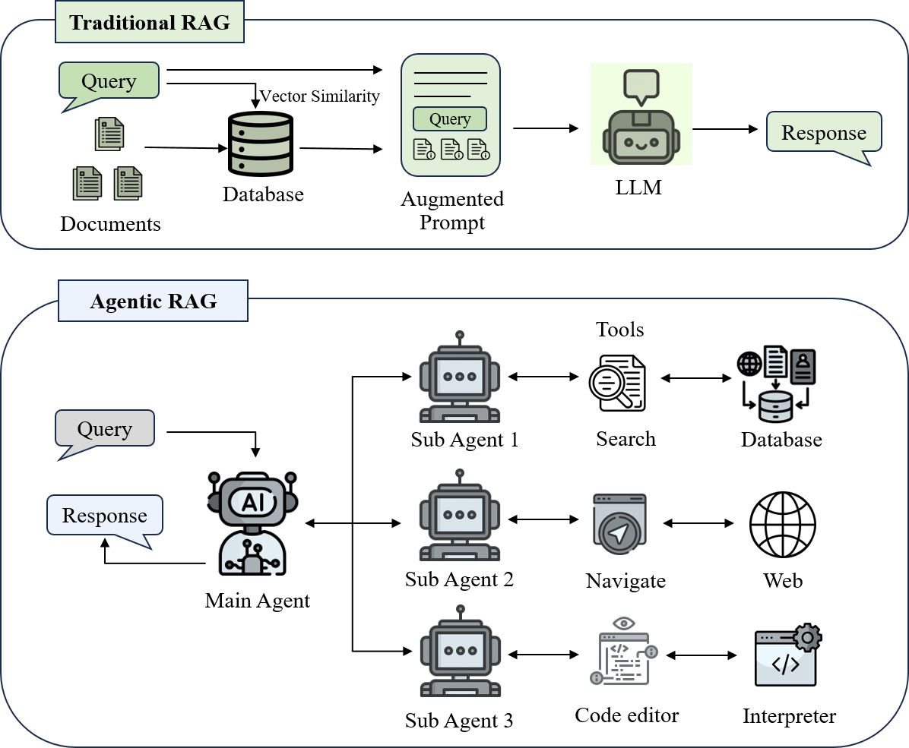
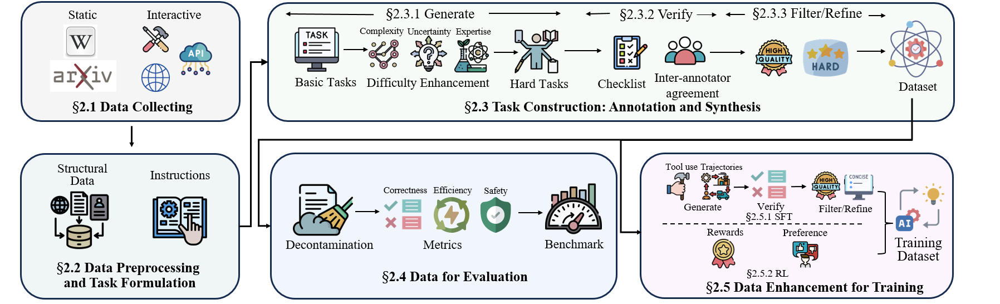

# Awesome-AgenticRAG-Data

## Abstract

Large Language Models (LLMs) excel at natural language understanding and generation, yet their reliance on static pre-training corpora may lead to outdated knowledge, hallucinations, and limited adaptability. Retrieval-Augmented Generation (RAG) mitigates these issues by grounding model outputs with external retrieval, but conventional RAG remains constrained by a fixed retrieve–then–generate routine and struggles with multi-step reasoning and tool calls. **Agentic RAG** addresses these limitations by enabling LLM agents to actively decompose tasks, issue exploratory queries, and refine evidence through iterative retrieval. Despite growing interest, the development of Agentic RAG is impeded by data scarcity: unlike traditional RAG, it requires challenging tasks that require planning, retrieval, and multiple reasoning decisions, and corresponding rich, interactive agent trajectories. This survey presents the first data-centric overview of Agentic RAG, framing its data lifecycle—data collecting, data preprocessing and task formulation, task construction, data for evaluation, and data enhancement for training—and cataloging representative systems and datasets in different domains (\eg question answering, web, software engineering). From data perspectives, we aim to guide the creation of scalable, high-quality datasets for the next generation of adaptive, knowledge-seeking LLM agents.

---

## Introduction

Large Language Models (LLMs) have greatly advanced AI with strong natural language understanding and generation.  
Yet their dependence on static pre-training data leads to outdated facts, hallucinations, and limited adaptability to fast-changing information. **Retrieval-Augmented Generation (RAG)** mitigates these issues by augmenting LLMs with retrieving real-time knowledge from external databases, APIs, or the web to ground generation.  
Nevertheless, traditional RAG follows a fixed retrieve–then-generate routine and struggles with multi-step reasoning or iterative retrieval.

Recent developments in *agentic AI* introduce autonomous LLM-based agents that can plan, reflect, and coordinate tool use.  
Combining this paradigm with RAG yields **Agentic RAG**, where agents actively drive retrieval, assess evidence, and refine outputs through iterative interaction.

Unlike traditional RAG, these RAG-reasoning agents perform *active knowledge seeking*: decomposing tasks, issuing exploratory queries to multiple sub-agents, and looping retrieval until sufficient information is obtained.

  

Despite growing interest, Agentic RAG development is hindered by *data scarcity*.  
Unlike traditional RAG—where static corpora suffice—Agentic RAG requires challenging tasks that require planning, retrieval, and multiple reasoning decisions, and corresponding rich, interactive agent trajectories.

| Stage             | Traditional RAG                                                                 | Agentic RAG                                                                                   |
|-------------------|----------------------------------------------------------------------------------|------------------------------------------------------------------------------------------------|
| **Data Collection** | Static data (e.g., Wikipedia, ArXiv)                                           | Interactive data (e.g., tool/API usage, web navigation)                                        |
| **Task Construction** | Basic tasks (single-step, solvable with direct retrieval)                     | Hard tasks (requiring decomposition, different tools, and reasoning)                           |
| **Evaluation Metrics** | Correctness                                                                   | Multiple axes (e.g., correctness, efficiency, safety)                                          |
| **Data for Training**   | Chain-of-Thought                                                              | Thought–action trajectories, preference pairs, process rewards, new data generated during training for self-improvement |

<em>Table&nbsp;1.&nbsp;Comparison of traditional RAG and Agentic RAG in data lifecycle.</em>

Such data are costly to annotate, difficult to scale, and prone to quality issues when automatically synthesized. Therefore, curating scalable and high-quality datasets and benchmarks has been a central problem in the development of Agentic RAG systems.

The data curation process in Agentic RAG has two distinctive aspects:  
- **Traditional RAG vs. Agentic RAG**: traditional RAG relies on query–document pairs, whereas Agentic RAG demands rich *agent–environment interaction traces* encoding planning and retrieval actions.  
- **Agentic RAG vs. general agents**: general agents often use tools such as calculators or code interpreters for problem solving, whereas Agentic RAG uses search engines and knowledge bases for *knowledge seeking*. In the former cases, tools provide clear solutions, while in Agentic RAG, tools may actually bring more information for the agent to process.

This survey frames Agentic RAG through a [data lifecycle](#data-lifecycle) that spans data collecting, data preprocessing and task formulation, task construction, data for evaluation, and data enhancement for training. Specifically, we adopt a *generate-verify-filter/refine pipeline* to analyze the curation process of tasks and trajectories.

  

## Data Lifecycle

### Data Collecting

### Data Preprocessing and Task Formulation

### Task Construction: Annotation and Synthesis

### Data for Evaluation

### Data Enhancement for Training

## Domain-Specific Agentic RAG Benchmarks
