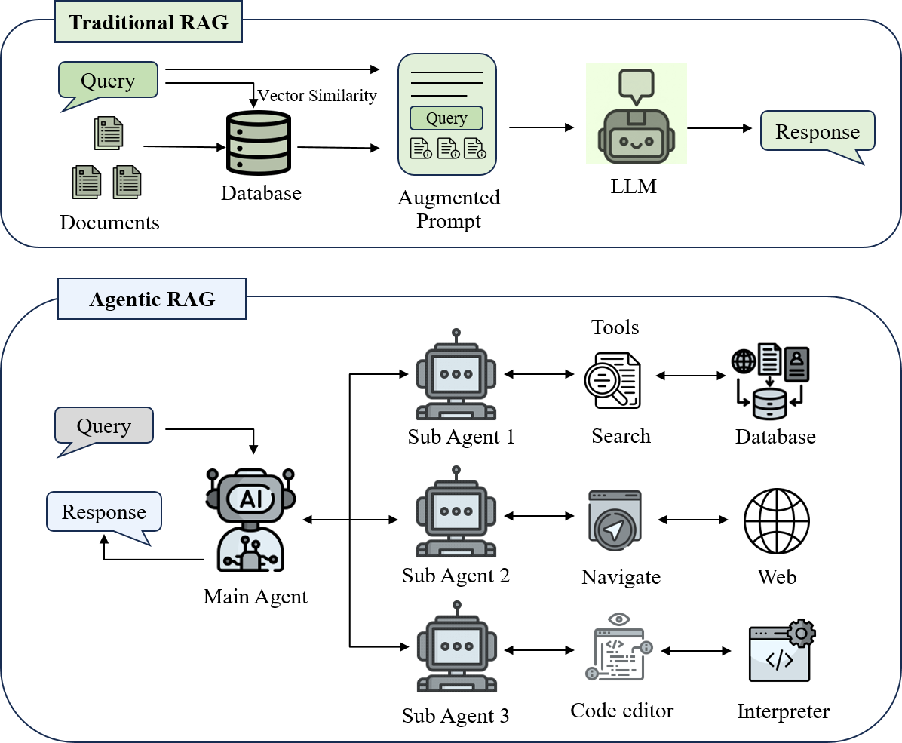

# Awesome-AgenticRAG-Data

## Table of Contents

1. [Abstract](#abstract)
2. [Introduction](#introduction)
3. [Data Lifecycle](#data-lifecycle)
4. [Domain-Specific Agentic RAG Benchmarks](domain-specific-agentic-rag-benchmarks)
5. [Related Surveys](related-surveys)

## Abstract

Large Language Models (LLMs) excel at natural language understanding and generation, yet their reliance on static pre-training corpora may lead to outdated knowledge, hallucinations, and limited adaptability. Retrieval-Augmented Generation (RAG) mitigates these issues by grounding model outputs with external retrieval, but conventional RAG remains constrained by a fixed retrieve–then–generate routine and struggles with multi-step reasoning and tool calls. **Agentic RAG** addresses these limitations by enabling LLM agents to actively decompose tasks, issue exploratory queries, and refine evidence through iterative retrieval. Despite growing interest, the development of Agentic RAG is impeded by data scarcity: unlike traditional RAG, it requires challenging tasks that require planning, retrieval, and multiple reasoning decisions, and corresponding rich, interactive agent trajectories. This survey presents the first data-centric overview of Agentic RAG, framing its data lifecycle—data collecting, data preprocessing and task formulation, task construction, data for evaluation, and data enhancement for training—and cataloging representative systems and datasets in different domains (\eg question answering, web, software engineering). From data perspectives, we aim to guide the creation of scalable, high-quality datasets for the next generation of adaptive, knowledge-seeking LLM agents.

---

## Introduction

Large Language Models (LLMs) have greatly advanced AI with strong natural language understanding and generation.  
Yet their dependence on static pre-training data leads to outdated facts, hallucinations, and limited adaptability to fast-changing information. **Retrieval-Augmented Generation (RAG)** mitigates these issues by augmenting LLMs with retrieving real-time knowledge from external databases, APIs, or the web to ground generation.  
Nevertheless, traditional RAG follows a fixed retrieve–then-generate routine and struggles with multi-step reasoning or iterative retrieval.

Recent developments in *agentic AI* introduce autonomous LLM-based agents that can plan, reflect, and coordinate tool use.  
Combining this paradigm with RAG yields **Agentic RAG**, where agents actively drive retrieval, assess evidence, and refine outputs through iterative interaction.

Unlike traditional RAG, these RAG-reasoning agents perform *active knowledge seeking*: decomposing tasks, issuing exploratory queries to multiple sub-agents, and looping retrieval until sufficient information is obtained.

  

Despite growing interest, Agentic RAG development is hindered by *data scarcity*.  
Unlike traditional RAG—where static corpora suffice—Agentic RAG requires challenging tasks that require planning, retrieval, and multiple reasoning decisions, and corresponding rich, interactive agent trajectories.

| Stage                  | Traditional RAG                                           | Agentic RAG                                                                                                             |
| ---------------------- | --------------------------------------------------------- | ----------------------------------------------------------------------------------------------------------------------- |
| **Data Collection**    | Static data (e.g., Wikipedia, ArXiv)                      | Interactive data (e.g., tool/API usage, web navigation)                                                                 |
| **Task Construction**  | Basic tasks (single-step, solvable with direct retrieval) | Hard tasks (requiring decomposition, different tools, and reasoning)                                                    |
| **Evaluation Metrics** | Correctness                                               | Multiple axes (e.g., correctness, efficiency, safety)                                                                   |
| **Data for Training**  | Chain-of-Thought                                          | Thought–action trajectories, preference pairs, process rewards, new data generated during training for self-improvement |

<em>Table 1. Comparison of traditional RAG and Agentic RAG in data lifecycle.</em>

Such data are costly to annotate, difficult to scale, and prone to quality issues when automatically synthesized. Therefore, curating scalable and high-quality datasets and benchmarks has been a central problem in the development of Agentic RAG systems.

The data curation process in Agentic RAG has two distinctive aspects:  

- **Traditional RAG vs. Agentic RAG**: traditional RAG relies on query–document pairs, whereas Agentic RAG demands rich *agent–environment interaction traces* encoding planning and retrieval actions.  
- **Agentic RAG vs. general agents**: general agents often use tools such as calculators or code interpreters for problem solving, whereas Agentic RAG uses search engines and knowledge bases for *knowledge seeking*. In the former cases, tools provide clear solutions, while in Agentic RAG, tools may actually bring more information for the agent to process.

This survey frames Agentic RAG through a [data lifecycle](#data-lifecycle) that spans data collecting, data preprocessing and task formulation, task construction, data for evaluation, and data enhancement for training. Specifically, we adopt a *generate-verify-filter/refine pipeline* to analyze the curation process of tasks and trajectories.

  

## Data Lifecycle

### Overview

1. [Data Collecting](#data-collecting)
   - [Static Data](#static-data)
   - [Interactive Data](#interactive-data)
2. [Data Preprocessing and Task Formulation](#data-preprocessing-and-task-formulation)
   - [Preprocessing](#preprocessing)
   - [Task Formulation](#task-formulation)
3. [Task Construction: Annotation and Synthesis](#task-construction-annotation-and-synthesis)
   - [Generate](#generate)
     - [Curating Methods](#curating-methods)
     - [Difficulty Enhancement](#difficulty-enhancement)
   - [Verify](#verify)
     - [Methods](#methods)
     - [Overlooked Validity Criteria](#overlooked-validity-criteria)
   - [Filter/Refine](#filterrefine)
     - [Quality](#quality)
     - [Difficulty](#difficulty)
4. [Data for Evaluation](#data-for-evaluation)
   - [Decontamination](#decontamination)
   - [Evaluation Metrics and Approaches](#evaluation-metrics-and-approaches)
     - [Correctness](#correctness)
     - [Beyond Correctness](#beyond-correctness)
5. [Data Enhancement for Training](#data-enhancement-for-training)
   - [SFT](#sft)
     - [Basic Tool-usage Skills](#basic-tool-usage-skills)
     - [Thought–action Trajectories](#thought–action-trajectories)

### Data Collecting

#### Static Data

- Wikipedia
  - (TACL 2019) **Natural Questions: A Benchmark for Question Answering Research** [[Paper]](https://aclanthology.org/Q19-1026.pdf) [[Code]](https://github.com/google-research-datasets/natural-questions) 
  - (EMNLP 2018) **HotpotQA: A Dataset for Diverse, Explainable Multi-hop Question Answering** [[Paper]](https://aclanthology.org/D18-1259/) [[Code]](https://github.com/hotpotqa/hotpot)   
  - (COLING 2020) **Constructing A Multi-hop QA Dataset for Comprehensive Evaluation of Reasoning Steps (2WikiMultihopQA)** [[Paper]](https://www.aclweb.org/anthology/2020.coling-main.51/) [[Code]](https://github.com/Alab-NII/2wikimultihop)    
- Github repositories
  - (ICLR 2024) **SWE-bench: Can Language Models Resolve Real-world Github Issues?** [[Paper]](https://arxiv.org/pdf/2310.06770) [[Code]](https://github.com/SWE-bench/SWE-bench)     
- Kaggle competitions
  - (ICLR 2025) **MLE-bench: Evaluating Machine Learning Agents on Machine Learning Engineering** [[Paper]](https://arxiv.org/pdf/2410.07095) [[Code]](https://github.com/openai/mle-bench) 

#### Interactive data

- API-based retrieval
  - (WWW 2025) **FlashRAG: A Modular Toolkit for Efficient Retrieval-Augmented Generation Research** [[Paper]](https://arxiv.org/pdf/2405.13576) [[Code]](https://github.com/RUC-NLPIR/FlashRAG) 
- Web navigation
  - **WebGPT: Browser-assisted question-answering with human feedback** [[Paper]](https://arxiv.org/pdf/2112.09332)
  - **WebDancer: Towards Autonomous Information Seeking Agency** [[Paper]](https://arxiv.org/pdf/2505.22648) [[Code]](https://github.com/Alibaba-NLP/DeepResearch) 

### Data Preprocessing and Task Formulation

#### Preprocessing

- (EMNLP2025) **LightRAG: Simple and Fast Retrieval-Augmented Generation** [[Paper]](https://arxiv.org/abs/2410.05779) [[Code]](https://github.com/HKUDS/LightRAG)  (relation schemas)

- **T-GRAG: A Dynamic GraphRAG Framework for Resolving Temporal Conflicts and Redundancy in Knowledge Retrieval** [[Paper]](https://arxiv.org/abs/2508.01680) [[Code]](https://github.com/Arvin0313/T-GRAG)  (chronological structure)
  
  #### Task Formulation

- Close-ended
  
  - (ACL 2017) **TriviaQA: A Large Scale Distantly Supervised Challenge Dataset for Reading Comprehension** [[Paper]](https://aclanthology.org/P17-1147.pdf) [[Code]](https://github.com/mandarjoshi90/triviaqa)  
  - (TACL 2019) **Natural Questions: A Benchmark for Question Answering Research** [[Paper]](https://aclanthology.org/Q19-1026.pdf) [[Code]](https://github.com/google-research-datasets/natural-questions)  

- Real-world workflows
  
  - (ICLR 2024) **SWE-bench: Can Language Models Resolve Real-world Github Issues?** [[Paper]](https://arxiv.org/pdf/2310.06770) [[Code]](https://github.com/SWE-bench/SWE-bench) 
  - (ICLR 2025) **MLE-bench: Evaluating Machine Learning Agents on Machine Learning Engineering** [[Paper]](https://arxiv.org/pdf/2410.07095) [[Code]](https://github.com/openai/mle-bench) 

- Creative (Academic Writing)
  
  - (Neurips 2024) **AutoSurvey: Large Language Models Can Automatically Write Surveys** [[Paper]](https://proceedings.neurips.cc/paper_files/paper/2024/file/d07a9fc7da2e2ec0574c38d5f504d105-Paper-Conference.pdf) [[Code]](https://github.com/AutoSurveys/AutoSurvey) 
  - (ACL 2025) **SurveyForge: On the Outline Heuristics, Memory-Driven Generation, and Multi-dimensional Evaluation for Automated Survey Writing** [[Paper]](https://aclanthology.org/2025.acl-long.609.pdf) [[Code]](https://github.com/Alpha-Innovator/SurveyForge) 
  - **SurveyX: Academic Survey Automation via Large Language Models** [[Paper]](https://arxiv.org/pdf/2502.14776) [[Code]](https://github.com/IAAR-Shanghai/SurveyX) 
  - **Agent Laboratory: Using LLM Agents as Research Assistants** [[Paper]](https://arxiv.org/pdf/2501.04227) [[Code]](https://github.com/SamuelSchmidgall/AgentLaboratory) 
  
  ### Task Construction: Annotation and Synthesis
  
  #### Generate
  
  ##### Curating Methods

- Crowdsourced
  
  - (TACL 2019) **Natural Questions: A Benchmark for Question Answering Research** [[Paper]](https://aclanthology.org/Q19-1026.pdf) [[Code]](https://github.com/google-research-datasets/natural-questions) 
  - (EMNLP 2018) **HotpotQA: A Dataset for Diverse, Explainable Multi-hop Question Answering** [[Paper]](https://aclanthology.org/D18-1259/) [[Code]](https://github.com/hotpotqa/hotpot) 
  - **Measuring short-form factuality in large language models (SimpleQA)** [[Paper]](https://arxiv.org/pdf/2411.04368) [[Code]](https://github.com/openai/simple-evals) 
  - **BrowseComp: A Simple Yet Challenging Benchmark for Browsing Agents** [[Paper]](https://arxiv.org/pdf/2504.12516) [[Code]](https://github.com/openai/simple-evals) 
  - (ICLR 2024) **GAIA: a benchmark for General AI Assistants** [[Paper]](https://arxiv.org/abs/2311.12983) [[Dataset]](https://huggingface.co/gaia-benchmark)

- Ready tasks on Internet
  
  - (ACL 2017) **TriviaQA: A Large Scale Distantly Supervised Challenge Dataset for Reading Comprehension** [[Paper]](https://aclanthology.org/P17-1147.pdf) [[Code]](https://github.com/mandarjoshi90/triviaqa) 
  - (ICLR 2024) **SWE-bench: Can Language Models Resolve Real-world Github Issues?** [[Paper]](https://arxiv.org/pdf/2310.06770) [[Code]](https://github.com/SWE-bench/SWE-bench) 
  - (ICLR 2025) **MLE-bench: Evaluating Machine Learning Agents on Machine Learning Engineering** [[Paper]](https://arxiv.org/pdf/2410.07095) [[Code]](https://github.com/openai/mle-bench) 

- Synthetic
  
  - (COLING 2020) **Constructing A Multi-hop QA Dataset for Comprehensive Evaluation of Reasoning Steps (2WikiMultihopQA)** [[Paper]](https://www.aclweb.org/anthology/2020.coling-main.51/) [[Code]](https://github.com/Alab-NII/2wikimultihop) 
  - (ACL 2024) **INTERS: Unlocking the Power of Large Language Models in Search with Instruction Tuning** [[Paper]](https://aclanthology.org/2024.acl-long.154/) [[Code]](https://github.com/DaoD/INTERS) 
  - (Neurips 2024) **Gorilla: Large Language Model Connected with Massive APIs** [[Paper]](https://proceedings.neurips.cc/paper_files/paper/2024/file/e4c61f578ff07830f5c37378dd3ecb0d-Paper-Conference.pdf) [[Code]](https://github.com/ShishirPatil/gorilla) 
  - **WebDancer: Towards Autonomous Information Seeking Agency** [[Paper]](https://arxiv.org/pdf/2505.22648) [[Code]](https://github.com/Alibaba-NLP/DeepResearch)   
  
  ##### Difficulty Enhancement

- Complexity
  
  - (EMNLP 2018) **HotpotQA: A Dataset for Diverse, Explainable Multi-hop Question Answering** [[Paper]](https://aclanthology.org/D18-1259/) [[Code]](https://github.com/hotpotqa/hotpot)  (multi hops)
  - (COLING 2020) **Constructing A Multi-hop QA Dataset for Comprehensive Evaluation of Reasoning Steps (2WikiMultihopQA)** [[Paper]](https://www.aclweb.org/anthology/2020.coling-main.51/) [[Code]](https://github.com/Alab-NII/2wikimultihop)  (multi hops)
  - (TACL 2022) **MuSiQue: Multihop Questions via Single-hop Question Composition** [[Paper]](https://aclanthology.org/2022.tacl-1.31.pdf) [[Code]](https://github.com/stonybrooknlp/musique)  (multi hops)
  - **TaskCraft: Automated Generation of Agentic Tasks** [[Paper]](https://arxiv.org/abs/2506.10055) [[Code]](https://github.com/OPPO-PersonalAI/TaskCraft)  (multi hops)
  - **WebDancer: Towards Autonomous Information Seeking Agency** [[Paper]](https://arxiv.org/pdf/2505.22648) [[Code]](https://github.com/Alibaba-NLP/DeepResearch)  (multi hops)
  - (ACL 2024) **On the Multi-turn Instruction Following for Conversational Web Agents** [[Paper]](https://aclanthology.org/2024.acl-long.477.pdf) [[Code]](https://github.com/magicgh/self-map)  (multi-turn conversations)
  - (ACL 2025) **WebWalker: Benchmarking LLMs in Web Traversal** [[Paper]](https://aclanthology.org/2025.acl-long.508.pdf) [[Code]](https://github.com/Alibaba-NLP/DeepResearch)  (multiple webpages)
  - (ICLR 2024) **SWE-bench: Can Language Models Resolve Real-world Github Issues?** [[Paper]](https://arxiv.org/pdf/2310.06770) [[Code]](https://github.com/SWE-bench/SWE-bench)  (repo-level coding)
  - (ICLR 2024) **RepoBench: Benchmarking Repository-Level Code Auto-Completion Systems** [[Paper]](https://arxiv.org/abs/2306.03091) [[Code]](https://github.com/Leolty/repobench)  (repo-level coding)
  - (ICLR 2024) **GAIA: a benchmark for General AI Assistants** [[Paper]](https://arxiv.org/abs/2311.12983) [[Dataset]](https://huggingface.co/gaia-benchmark) (multiple tools)

- Uncertainty
  
  - (TACL 2021) **Did Aristotle Use a Laptop? A Question Answering Benchmark with Implicit Reasoning Strategies (StrategyQA)** [[Paper]](https://aclanthology.org/2021.tacl-1.21.pdf) [[Code]](https://github.com/eladsegal/strategyqa)  (implicit reasoning tasks)
  - (COLING 2020) **Constructing A Multi-hop QA Dataset for Comprehensive Evaluation of Reasoning Steps (2WikiMultihopQA)** [[Paper]](https://www.aclweb.org/anthology/2020.coling-main.51/) [[Code]](https://github.com/Alab-NII/2wikimultihop)  (distractors in reference documents)
  - (TACL 2022) **MuSiQue: Multihop Questions via Single-hop Question Composition** [[Paper]](https://aclanthology.org/2022.tacl-1.31.pdf) [[Code]](https://github.com/stonybrooknlp/musique)  (distractors in reference documents, unanswerable questions)
  - **WebSailor: Navigating Super-human Reasoning for Web Agent** [[Paper]](https://arxiv.org/pdf/2507.02592) [[Code]](https://github.com/Alibaba-NLP/DeepResearch)  (obfuscate key information)
  - **BrowseComp: A Simple Yet Challenging Benchmark for Browsing Agents** [[Paper]](https://arxiv.org/pdf/2504.12516) [[Code]](https://github.com/openai/simple-evals)  (inverted problems)

- Expertise
  
  - (COLM 2024) **GPQA: A Graduate-Level Google-Proof Q&A Benchmark** [[Paper]](https://arxiv.org/abs/2311.12022) [[Code]](https://github.com/idavidrein/gpqa) 
  - **Humanity's Last Exam** [[Paper]](https://arxiv.org/abs/2501.14249) [[Code]](https://github.com/centerforaisafety/hle) 
  
  #### Verify
  
  ##### Methods

- Human-based (inter-annotator agreement)
  
  - **Measuring short-form factuality in large language models (SimpleQA)** [[Paper]](https://arxiv.org/pdf/2411.04368) [[Code]](https://github.com/openai/simple-evals) 
  - **BrowseComp: A Simple Yet Challenging Benchmark for Browsing Agents** [[Paper]](https://arxiv.org/pdf/2504.12516) [[Code]](https://github.com/openai/simple-evals) 
  - (ICLR 2024) **GAIA: a benchmark for General AI Assistants** [[Paper]](https://arxiv.org/abs/2311.12983) [[Dataset]](https://huggingface.co/gaia-benchmark)

- LLM-based
  
  - (ACL 2024 findings) **Chain-of-Verification Reduces Hallucination in Large Language Models** [[Paper]](https://aclanthology.org/2024.findings-acl.212.pdf) [[Code]](https://github.com/ritun16/chain-of-verification) 
  
  ##### Overlooked Validity Criteria

- QA
  
  - **Measuring short-form factuality in large language models (SimpleQA)** [[Paper]](https://arxiv.org/pdf/2411.04368) [[Code]](https://github.com/openai/simple-evals)  (unique, time-invariant answer)
  - (ICLR 2024) **GAIA: a benchmark for General AI Assistants** [[Paper]](https://arxiv.org/abs/2311.12983) [[Dataset]](https://huggingface.co/gaia-benchmark) (unique, time-invariant answer)

- Code
  
  - (ICLR 2024) **SWE-bench: Can Language Models Resolve Real-world Github Issues?** [[Paper]](https://arxiv.org/pdf/2310.06770) [[Code]](https://github.com/SWE-bench/SWE-bench)  (environment reproducible, reference code passable)
  
  #### Filter/Refine
  
  ##### Quality

- (ACL 2025) **WebWalker: Benchmarking LLMs in Web Traversal** [[Paper]](https://aclanthology.org/2025.acl-long.508.pdf) [[Code]](https://github.com/Alibaba-NLP/DeepResearch)  (linguistic naturalness)

- **A Functionality-Grounded Benchmark for Evaluating Web Agents in E-commerce Domains (Amazon-bench)** [[Paper]](https://www.arxiv.org/pdf/2508.15832) (linguistic naturalness)

- (EMNLP 2020) **Is Multihop QA in DIRE Condition? Measuring and Reducing Disconnected Reasoning** [[Paper]](https://aclanthology.org/2020.emnlp-main.712.pdf) [[Code]](https://github.com/stonybrooknlp/dire)  (no data leakage or exploitable shortcuts)

- (TACL 2022) **MuSiQue: Multihop Questions via Single-hop Question Composition** [[Paper]](https://aclanthology.org/2022.tacl-1.31.pdf) [[Code]](https://github.com/stonybrooknlp/musique)  (no data leakage or exploitable shortcuts)

- **Agent Laboratory: Using LLM Agents as Research Assistants** [[Paper]](https://arxiv.org/pdf/2501.04227) [[Code]](https://github.com/SamuelSchmidgall/AgentLaboratory)  (source credibility)
  
  ##### Difficulty

- rule-based
  
  - **TaskCraft: Automated Generation of Agentic Tasks** [[Paper]](https://arxiv.org/abs/2506.10055) [[Code]](https://github.com/OPPO-PersonalAI/TaskCraft)  (number of hops)
  - (ACL 2025) **WebWalker: Benchmarking LLMs in Web Traversal** [[Paper]](https://aclanthology.org/2025.acl-long.508.pdf) [[Code]](https://github.com/Alibaba-NLP/DeepResearch)  (number of hops)
  - (ICLR 2024) **GAIA: a benchmark for General AI Assistants** [[Paper]](https://arxiv.org/abs/2311.12983) [[Dataset]](https://huggingface.co/gaia-benchmark) (number of tools)
  - (TACL 2022) **MuSiQue: Multihop Questions via Single-hop Question Composition** [[Paper]](https://aclanthology.org/2022.tacl-1.31.pdf) [[Code]](https://github.com/stonybrooknlp/musique)  (with or without unanswerable questions)
  - (COLM 2024) **GPQA: A Graduate-Level Google-Proof Q&A Benchmark** [[Paper]](https://arxiv.org/abs/2311.12022) [[Code]](https://github.com/idavidrein/gpqa)  (accuracy of experts and non-experts)

- LLM-based (LLM's success rate as proxy)
  
  - (Neurips 2024) **Easy2Hard-Bench: Standardized Difficulty Labels for Profiling LLM Performance and Generalization** [[Paper]](https://proceedings.neurips.cc/paper_files/paper/2024/file/4e6f22305275966513990f53cec908e0-Paper-Datasets_and_Benchmarks_Track.pdf) [[Code]](https://github.com/umd-huang-lab/Easy2Hard-Bench) 
  - **TaskEval: Assessing Difficulty of Code Generation Tasks for Large Language Models** [[Paper]](https://arxiv.org/pdf/2407.21227v2)
  
  ### Data for Evaluation
  
  #### Decontamination

- (TACL 2022) **MuSiQue: Multihop Questions via Single-hop Question Composition** [[Paper]](https://aclanthology.org/2022.tacl-1.31.pdf) [[Code]](https://github.com/stonybrooknlp/musique)  (filter out multi-hop questions in test split with any identical single-hop component in train split)

- (ICLR 2024) **GAIA: a benchmark for General AI Assistants** [[Paper]](https://arxiv.org/abs/2311.12983) [[Dataset]](https://huggingface.co/gaia-benchmark) (question does not exist on the internet in plain text)
  
  #### Evaluation Metrics and Approaches
  
  ##### Correctness
  
  For this part, please refer to [task formulation](#task-formulation) for the papers.

- Gold-standard answers

- Programmatic validators

- LLM-as-a-judge
  
  ##### Beyond Correctness

- (ACL 2025) **WebWalker: Benchmarking LLMs in Web Traversal** [[Paper]](https://aclanthology.org/2025.acl-long.508.pdf) [[Code]](https://github.com/Alibaba-NLP/DeepResearch)  (**efficiency:** the action count of successful agentic executions)

- **A Functionality-Grounded Benchmark for Evaluating Web Agents in E-commerce Domains (Amazon-bench)** [[Paper]](https://www.arxiv.org/pdf/2508.15832) (**safety:** benign failures vs. harmful failures)
  
  ### Data Enhancement for Training
  
  #### SFT
  
  ##### Basic Tool-usage Skills
  
  - (Neurips 2023) **Toolformer: Language Models Can Teach Themselves to Use Tools** [[Paper]](https://proceedings.neurips.cc/paper_files/paper/2023/file/d842425e4bf79ba039352da0f658a906-Paper-Conference.pdf) [[Code]](https://github.com/conceptofmind/toolformer)  (modify pretraining corpora)
  - (ACL 2024) **INTERS: Unlocking the Power of Large Language Models in Search with Instruction Tuning** [[Paper]](https://aclanthology.org/2024.acl-long.154/) [[Code]](https://github.com/DaoD/INTERS)  (integrate multiple resources into meta-datasets)
  - (Neurips 2024) **Gorilla: Large Language Model Connected with Massive APIs** [[Paper]](https://proceedings.neurips.cc/paper_files/paper/2024/file/e4c61f578ff07830f5c37378dd3ecb0d-Paper-Conference.pdf) [[Code]](https://github.com/ShishirPatil/gorilla)  (self-instruction and in-context learning)
  
  ##### Thought–action Trajectories

- Generate
  
  - (Neurips 2022) **STaR: Bootstrapping Reasoning With Reasoning** [[Paper]](https://proceedings.neurips.cc/paper_files/paper/2022/file/639a9a172c044fbb64175b5fad42e9a5-Paper-Conference.pdf) [[Code]](https://github.com/ezelikman/STaR)  (in-context bootstrapping)
  - **Distilling LLM Agent into Small Models with Retrieval and Code Tools** [[Paper]](https://arxiv.org/pdf/2505.17612) [[Code]](https://github.com/Nardien/agent-distillation)  (trajectory distillation)
  - **WebSailor: Navigating Super-human Reasoning for Web Agent** [[Paper]](https://arxiv.org/pdf/2507.02592) [[Code]](https://github.com/Alibaba-NLP/DeepResearch)  (trajectory distillation)
  - **WebShaper: Agentically Data Synthesizing via Information-Seeking Formalization** [[Paper]](https://arxiv.org/pdf/2507.15061) [[Code]](https://github.com/Alibaba-NLP/DeepResearch)  (trajectory distillation)

- Filter/Refine
  
  - (ACL 2025 Findings) **Unveiling the Key Factors for Distilling Chain-of-Thought Reasoning** [[Paper]](https://aclanthology.org/2025.findings-acl.782/) [[Code]](https://github.com/EIT-NLP/Distilling-CoT-Reasoning)  (**quality** influenced by factors such as trajectory granularity, formatting choices, and the teacher model used)
  - **WebShaper: Agentically Data Synthesizing via Information-Seeking Formalization** [[Paper]](https://arxiv.org/pdf/2507.15061) [[Code]](https://github.com/Alibaba-NLP/DeepResearch)  (**conciseness:** filters out trajectories with severe repetition)
  - **WebSailor: Navigating Super-human Reasoning for Web Agent** [[Paper]](https://arxiv.org/pdf/2507.02592) [[Code]](https://github.com/Alibaba-NLP/DeepResearch)  (**conciseness:** reconstructs concise rationales from action–observation sequences)
  - **Deconstructing Long Chain-of-Thought: A Structured Reasoning Optimization Framework for Long CoT Distillation** [[Paper]](https://arxiv.org/pdf/2503.16385)(**conciseness:** removes redundant or incorrect reasoning paths)

#### RL

##### Outcome-based Rewards

- (COLM 2025) **Search-R1: Training LLMs to Reason and Leverage Search Engines with Reinforcement Learning** [[Paper]](https://arxiv.org/pdf/2503.09516) [[Code]](https://github.com/PeterGriffinJin/Search-R1) 
- **R1-Searcher: Incentivizing the Search Capability in LLMs via Reinforcement Learning** [[Paper]](https://arxiv.org/pdf/2503.05592) [[Code]](https://github.com/RUCAIBox/R1-Searcher) 
- **DeepResearcher: Scaling Deep Research via Reinforcement Learning in Real-world Environments** [[Paper]](https://arxiv.org/abs/2504.03160) [[Code]](https://github.com/GAIR-NLP/DeepResearcher) 
- **ReSearch: Learning to Reason with Search for LLMs via Reinforcement Learning** [[Paper]](https://arxiv.org/abs/2503.19470) [[Code]](https://github.com/Agent-RL/ReCall) 
- **WebDancer: Towards Autonomous Information Seeking Agency** [[Paper]](https://arxiv.org/pdf/2505.22648) [[Code]](https://github.com/Alibaba-NLP/DeepResearch) 
- **WebSailor: Navigating Super-human Reasoning for Web Agent** [[Paper]](https://arxiv.org/pdf/2507.02592) [[Code]](https://github.com/Alibaba-NLP/DeepResearch)  
- **WebShaper: Agentically Data Synthesizing via Information-Seeking Formalization** [[Paper]](https://arxiv.org/pdf/2507.15061) [[Code]](https://github.com/Alibaba-NLP/DeepResearch) 

##### Data-aware Rewards

- (COLM 2025) **DeepRetrieval: Hacking Real Search Engines and Retrievers with Large Language Models via Reinforcement Learning** [[Paper]](https://arxiv.org/abs/2503.00223) [[Code]](https://github.com/pat-jj/DeepRetrieval)  (retrieval rewards)
- **ReZero: Enhancing LLM search ability by trying one-more-time** [[Paper]](https://arxiv.org/pdf/2504.11001) [[Code]](https://github.com/menloresearch/ReZero)  (retrieval rewards)
- (Neurips 2025) **WebThinker: Empowering Large Reasoning Models with Deep Research Capability** [[Paper]](https://arxiv.org/pdf/2504.21776) [[Code]](https://github.com/sunnynexus/WebThinker)  (preference pairs based on quality, efficiency, and conciseness)

## Domain-Specific Agentic RAG Benchmarks

<table>
  <thead>
    <tr>
      <th>Name</th><th>Task</th><th>Source</th><th>Scale</th><th>Metrics</th><th>Data Curating Method</th>
    </tr>
  </thead>
  <tbody>
    <tr><td colspan="6" align="center"><b>Question Answering (QA)</b></td></tr>
    <tr><td>NQ</td><td>Single-hop QA</td><td>Google queries, Wikipedia</td><td>train 307k, dev 7.8k, test 7.8k</td><td>-</td><td>Select queries from Google. Search for relevant documents in Wikipedia, and ask annotators to identify answers and filter low-quality questions.</td></tr>
    <tr><td>TriviaQA</td><td>Single-hop QA</td><td>Quiz websites, Wikipedia and Internet</td><td>train 76.5k, val 10.0k, test 9.5k</td><td>-</td><td>Select questions from 14 quiz websites. Search for relevant documents in Wikipedia and Internet, and keep those with answers.</td></tr>
    <tr><td>SimpleQA</td><td>Single-hop QA</td><td>Crowdsourced</td><td>4326</td><td>-</td><td>Annotators create questions with unique time-invariant answer. All questions are verified by another person independently. Keep only those that are incorrectly answered at least once in 4 times by gpt-4.</td></tr>
    <tr><td>HotpotQA</td><td>Multi-hop QA</td><td>Crowdsourced from Wikipedia</td><td>train 90.4k, val 7.4k, test 7.4k</td><td>-</td><td>Build a relation graph from the links in Wikipedia. Choose relevant paragraphs from it, and ask annotators to create multi-hop questions based on the paragraphs and identify supporting facts in them.</td></tr>
    <tr><td>2WikiMultihopQA</td><td>Multi-hop QA</td><td>Synthesized from Wikipedia</td><td>train medium 155k, train hard 12.6k, dev 12.6k, test 12.6k</td><td>-</td><td>Classify the entities in Wikidata. Manually write different question templates, and sample entities to create questions. Filter out questions with no answer or multiple answers. Add distractors in supporting documents.</td></tr>
    <tr><td>MuSiQue</td><td>Multi-hop QA</td><td>Synthesized and annotated from Wikipedia</td><td>train 39.9k, val 4.8k, test 4.9k</td><td>-</td><td>Collect Wikipedia-based single-hop questions. Compose 2-hop questions and filter out those with shortcuts. Build different multi-hop question structures and crowdsource questions. Add distractors in supporting documents. Add unanswerable questions.</td></tr>
    <tr><td>Bamboogle</td><td>Multi-hop QA</td><td>Manually created from Wikipedia</td><td>125</td><td>-</td><td>Create 2-hop questions based on Wikipedia. Keep only those that cannot be directly searched for the correct answer.</td></tr>
    <tr><td>Taskcraft</td><td>Multi-hop QA</td><td>Synthesized from different corpus</td><td>36k</td><td>-</td><td>Generate single-hop questions based on different corpus by LLM. Extend to multi-hop questions via depth-based and width-based extension. Filter out those with shortcuts.</td></tr>
    <tr><td colspan="6" align="center"><b>Web</b></td></tr>
    <tr><td>WebArena</td><td>QA-like & task-oriented web interaction</td><td>Custom web environments (shopping, email, forum, map, social media)</td><td>7 environments, 812 tasks</td><td>Task success rate</td><td>Provide realistic multi-page websites. Annotators design diverse tasks requiring navigation, reasoning and interaction.</td></tr>
    <tr><td>AgentBench</td><td>Open-ended web tasks with tool use</td><td>Real-world web APIs and websites</td><td>8 domains, 2000+ tasks</td><td>Success rate, human eval</td><td>Collect tasks from multiple domains (travel, shopping, QA, etc.). Provide tool APIs and human-verified success criteria.</td></tr>
    <tr><td>GAIA</td><td>Complex open-domain information-seeking</td><td>Live web environment</td><td>466 tasks (300 retained answers)</td><td>F1 score, factual accuracy</td><td>Ask annotators to design multi-step questions requiring reasoning, planning and external search. Include hidden evaluation sets to test real-time retrieval.</td></tr>
    <tr><td>BrowseComp</td><td>Fact-seeking QA over web browsing</td><td>Internet (open web), human-crafted QA</td><td>1,266 questions</td><td>Exact match</td><td>Questions designed so answer is short and verifiable. Human annotators ensure difficulty (not solved by existing models, not in top search results), enforce time/effort thresholds.</td></tr>
    <tr><td>WebWalkerQA</td><td>Multi-hop QA via web navigation</td><td>Real Wikipedia + open web</td><td>680 questions</td><td>Exact match, F1 score</td><td>Generate multi-hop QA pairs requiring active web navigation. Filter with LLM-based difficulty control and human verification.</td></tr>
    <tr><td>Amazon-Bench</td><td>E-commerce</td><td>Live Amazon.com webpages</td><td>400 user queries across 7 task types</td><td>Task success rate, harmful/benign failure rate, efficiency</td><td>Explore and categorize 60k+ Amazon pages. Sample diverse pages by functionality score, then prompt LLMs to generate realistic user queries and refine them to make them sound more natural and user-like.</td></tr>
    <tr><td colspan="6" align="center"><b>Software Engineering</b></td></tr>
    <tr><td>SWE-bench</td><td>Generate a pull request (PR) to solve a given issue</td><td>GitHub issues from 12 Python repositories</td><td>train 19k, test 2294</td><td>Unit test pass rate</td><td>Select PRs that resolve an issue and contribute tests. Keep only those that install successfully and passes all tests.</td></tr>
    <tr><td>RepoBench</td><td>Code retrieval, code completion</td><td>Github-code dataset, Github Python and Java repositories</td><td>Python 24k, Java 26k</td><td>Golden snippet matching, line matching</td><td>Random sample lines as completion goals (with a first-to-use subset). Extract candidate snippets based on import codes, and annotate golden snippets.</td></tr>
    <tr><td>DevEval</td><td>Repository-level function completion</td><td>Popular repositories from PyPI</td><td>1874</td><td>Unit test pass rate, recall of reference dependency</td><td>Select functions with test cases from repositories. Ask annotators to write requirements and reference dependencies. Filter out those with no cross-file dependency.</td></tr>
    <tr><td colspan="6" align="center"><b>Machine Learning</b></td></tr>
    <tr><td>MLAgentbench</td><td>Improve the performance metric by at least 10% over the baseline in the starter code</td><td>Kaggle</td><td>13</td><td>Success rate of 10% improvement, total time and tokens</td><td>Manually construct task description, starter code and evaluation code.</td></tr>
    <tr><td>MLEbench</td><td>Achieve the best score on a metric pre-defined for each competition</td><td>Kaggle</td><td>75</td><td>Test score compared on leaderboard (e.g. medals)</td><td>Crawl task description, dataset, grading code and leaderboard from Kaggle website. Keep only those reproducible and up-to-date. Manually label the category and difficulty.</td></tr>
    <tr><td colspan="6" align="center"><b>Medical</b></td></tr>
    <tr><td>MedQA</td><td>Four-option multiple-choice question</td><td>National Medical Board Examination</td><td>train 48.9k, dev 6.1k, test 8.1k</td><td>Exact match</td><td>Collect question-answer pairs from the National Medical Board Examination.</td></tr>
    <tr><td>MedMCQA</td><td>Four-option multiple-choice QA resembling medical exams</td><td>Open websites and books, All India Institute of Medical Sciences, National Eligibility cum Entrance Test</td><td>train 18.2k, dev 4.2k, test 6.2k</td><td>Exact Match</td><td>Collect question-answer pairs from medical examinations. Use rule-based method to preprocess the data. Split the dataset by exams (the training set consists of questions from mock and online exams, while the developing and test set consists of questions from formal exams.)</td></tr>
    <tr><td>Quilt-VQA</td><td>VQA (Vision question answering)</td><td>Educational histopathology videos in Youtube</td><td>Image-dependent: 1055, General-knowledge: 255</td><td>LLM evaluation</td><td>Localize the "?"s in the video's transcript. Extract the relevant texts and images. Prompt GPT-4 to generate QA pairs. Perform a manual verification.</td></tr>
    <tr><td>PathVQA</td><td>VQA</td><td>Electronic pathology textbooks and Pathology Education Informational Resource Digital Library website</td><td>Images: 4998, QA pairs: 32799</td><td>Accuracy(yes/no questions), exact match, Macro-averaged F1, BLEU</td><td>Extract images and their captions from the data sources. Perform natural language processing of the captions to break a long sentence into several short ones and get POS tagging. Generate open-ended questions based on POS tags and named entities.</td></tr>
    <tr><td>PMC-VQA</td><td>VQA</td><td>PMC-OA</td><td>Images: 149k, QA pairs: 227k</td><td>BLEU, accuracy</td><td>Prompt ChatGPT with the images and captions to generate QA pairs. Perform LLM-based and manual data filtering.</td></tr>
    <tr><td>PathMMU</td><td>VQA</td><td>PubMed, EduContent, Atlas, SocialPath, PathCLS</td><td>Images: train 16312, val 510, test 7213; QA pairs: train 23041, val 710, test 9677</td><td>-</td><td>Extract image-caption pairs from the data source. Prompt GPT-4V to generate detailed description of images and then three questions per image. Perform expert validation.</td></tr>
    <tr><td colspan="6" align="center"><b>Legal</b></td></tr>
    <tr><td>LegalBench</td><td>Issue-spotting, rule-recall, rule-application and rule-conclusion, interpretation, rhetorical-understanding</td><td>Existing datasets, in-house datasets</td><td>9.1k</td><td>Accuracy, human evaluation</td><td>Filter and restructure the data from the data sources.</td></tr>
    <tr><td>LegalBench-RAG</td><td>Retrieve snippets from legal corpora</td><td>LegalBench, PrivacyQA, CUAD, MAUD, ContractNLI</td><td>6889</td><td>Recall@k, precision@k</td><td>Start from LegalBench queries. Trace back each query’s context to its original document span in the corpus. Final dataset pairs each query with its exact evidence.</td></tr>
  </tbody>
</table>

---

*Metrics for QA are generally string matching (exact/fuzzy) or F1, and are omitted in the table.*

## Related Surveys

- **Agentic Retrieval-Augmented Generation: A Survey on Agentic RAG** [[Paper]](https://arxiv.org/pdf/2501.09136) [[GitHub]](https://github.com/asinghcsu/AgenticRAG-Survey)  (a general survey on Agentic RAG pipelines and frameworks)
- (EMNLP 2025) **Towards Agentic RAG with Deep Reasoning: A Survey of RAG-Reasoning Systems in LLMs** [[Paper]](https://arxiv.org/pdf/2507.09477) [[GitHub]](https://github.com/DavidZWZ/Awesome-RAG-Reasoning)  (the reasoning methods and frameworks in Agentic RAG)
